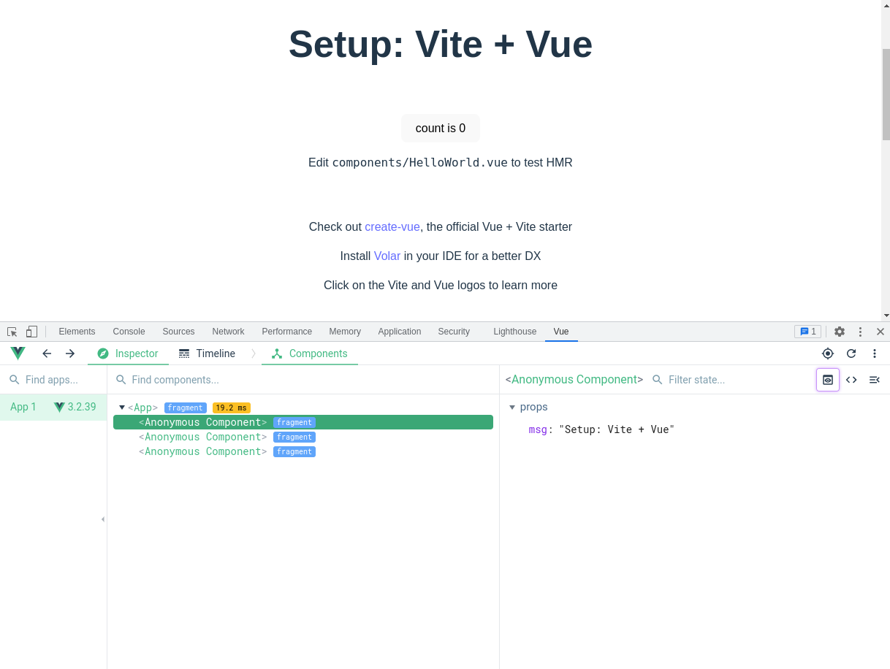
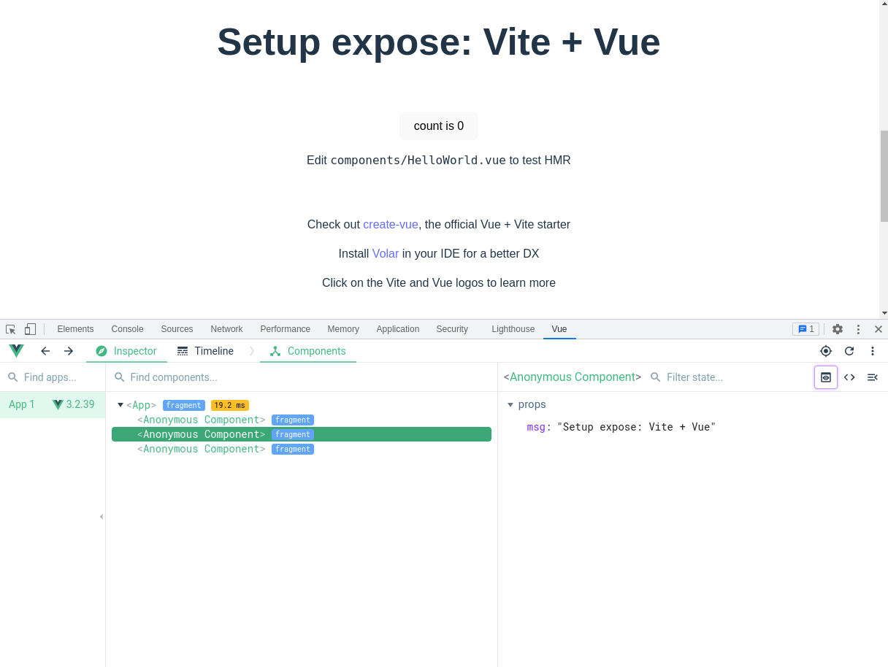
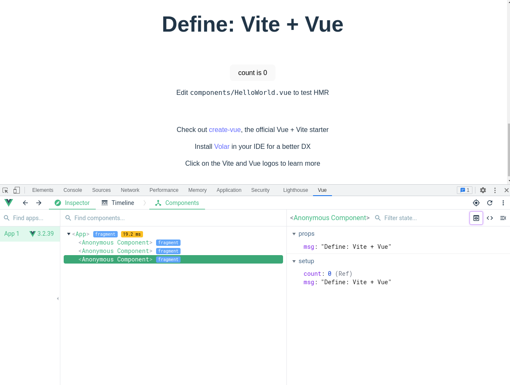

# Steps to reproduce

Install and run `vite dev`:

```bash
cd vitejs-vite-app
yarn
yarn dev
```

Inspect the component tree using vue devtools extension. It should have three components.
They are three versions of the same component created using:

- Setup script
- Setup script, but using `defineExpose` to expose bindings.
- `defineComponent`

Only the one created with `defineComponent` can be inspected. Screenshots below:




